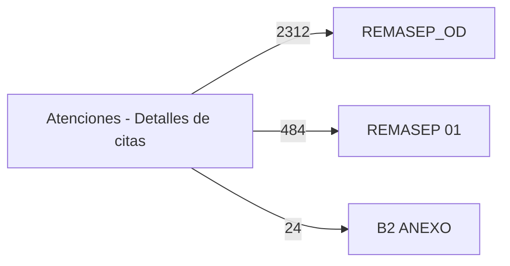

# Flujo actual del Excel (dependencias observadas)

> Generado por `scripts/analyze_dependencies.py`. Refleja **solo** dependencias técnicas entre celdas según el texto de las fórmulas: qué hoja lee celdas de qué otra hoja. **No** representa semántica REMASEP ni clínica y no infiere conexiones que no aparezcan en una fórmula.
>
> Archivo analizado: `GENERACION DATOS REMASEP.xlsx`  
> SHA256: `fc2e153659041abc50d82d13a84b4a1209e776681257c75b2383328933d15b79`  
> Generado: 2026-09-03T00:15:38Z  
> Hoja de detalle: `Atenciones - Detalles de citas`  
> Hojas output analizadas: `REMASEP 01`, `B2 ANEXO`, `REMASEP_OD`

## Grafo de dependencias entre hojas

Aristas `origen --(nº referencias)--> destino`: las fórmulas de *destino*
leen celdas de *origen*. Auto-referencias omitidas del grafo (ver tabla).

## Aristas observadas (cross-sheet)

| source_sheet | target_sheet | reference_count |
| --- | --- | --- |
| Atenciones - Detalles de citas | REMASEP_OD | 2312 |
| Atenciones - Detalles de citas | REMASEP 01 | 484 |
| Atenciones - Detalles de citas | B2 ANEXO | 24 |

## Auto-referencias (fórmulas que leen su propia hoja)

| sheet | reference_count |
| --- | --- |
| Atenciones - Detalles de citas | 42126 |
| REMASEP_OD | 4313 |
| REMASEP 01 | 1072 |
| B2 ANEXO | 6 |

## Constructs no soportados

No se encontraron `INDIRECT`, `OFFSET`, referencias externas,
*structured references*, referencias 3D ni errores `#REF!`.

