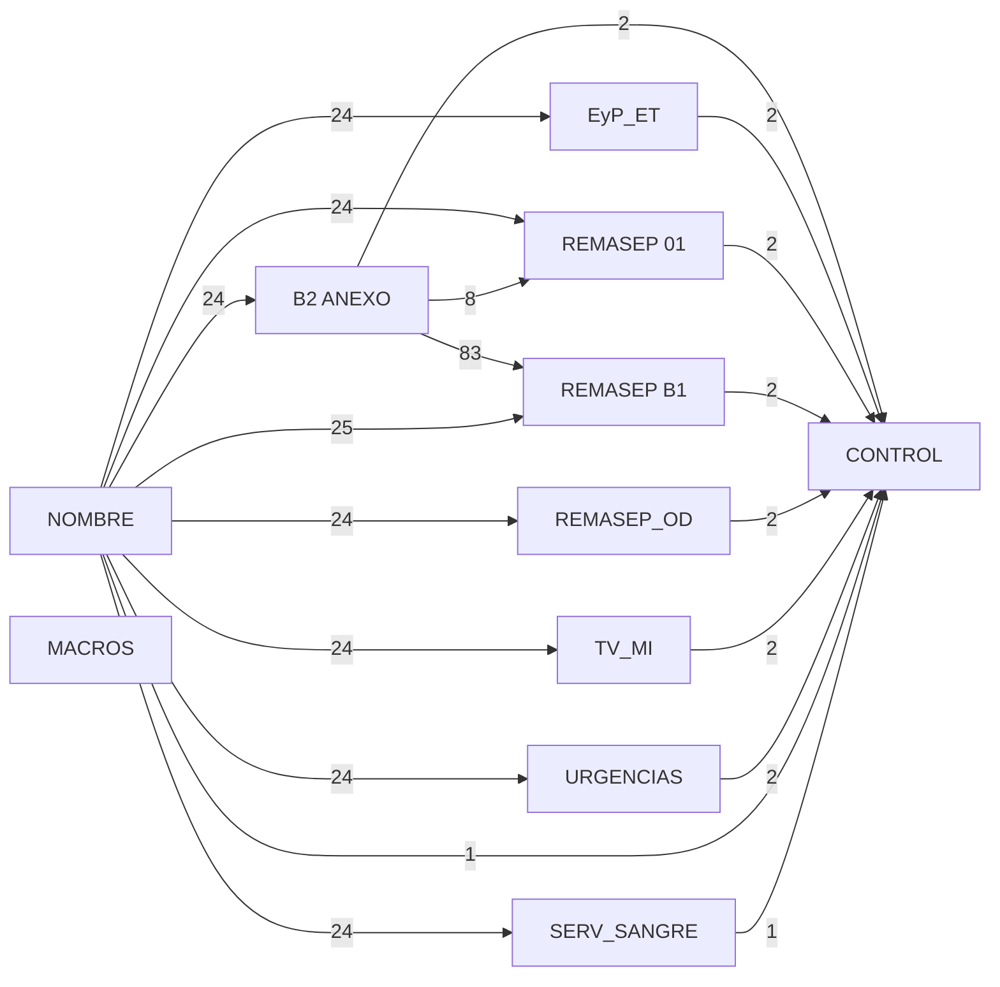

# Alineación con la plantilla oficial REMASEP

> Generado por `scripts/inventory_template.py`. Evidencia **estructural** y *candidatos* de alineación. No interpreta significado clínico, no confirma mappings y no ejecuta macros.
>
> Plantilla: `REMASEP 2026_V1.4.xlsm`  
> SHA256: `a59a335c605b676a294e69ca69a8dc53fcebe5f9f31b2f0d0bcb6574f2d60e64`  
> Generado: 2026-09-03T00:56:58Z  
> VBA presente: sí (49664 bytes)

## 1. Estructura de la plantilla oficial

| hoja | estado | filas | cols | fórmulas | merges | prot. | val. | filas ocultas | cols ocultas |
| --- | --- | ---: | ---: | ---: | ---: | :---: | ---: | ---: | ---: |
| NOMBRE | visible | 410 | 45 | 26 | 4 | sí | 3 | 0 | 13 |
| REMASEP 01 | visible | 307 | 259 | 1221 | 178 | sí | 10 | 1 | 17 |
| URGENCIAS | visible | 158 | 143 | 500 | 190 | sí | 3 | 1 | 30 |
| REMASEP B1 | visible | 135 | 254 | 162 | 72 | sí | 5 | 1 | 4 |
| B2 ANEXO | visible | 2867 | 4 | 88 | 101 | sí | 1 | 1 | 0 |
| REMASEP_OD | visible | 137 | 91 | 1407 | 67 | sí | 2 | 1 | 13 |
| EyP_ET | visible | 698 | 149 | 7551 | 465 | sí | 8 | 1 | 51 |
| TV_MI | visible | 101 | 86 | 271 | 40 | sí | 1 | 1 | 8 |
| SERV_SANGRE | visible | 319 | 30 | 223 | 216 | sí | 5 | 1 | 0 |
| CONTROL | visible | 16 | 8 | 17 | 10 | no | 0 | 0 | 0 |
| MACROS | visible | 13 | 22 | 0 | 2 | sí | 0 | 0 | 0 |

## 2. Hojas con fórmulas

`NOMBRE` (26), `REMASEP 01` (1221), `URGENCIAS` (500), `REMASEP B1` (162), `B2 ANEXO` (88), `REMASEP_OD` (1407), `EyP_ET` (7551), `TV_MI` (271), `SERV_SANGRE` (223), `CONTROL` (17)

## 3. Hojas que se alimentan entre sí (observado)

| origen | destino | referencias |
| --- | --- | ---: |
| B2 ANEXO | REMASEP B1 | 83 |
| NOMBRE | REMASEP B1 | 25 |
| NOMBRE | B2 ANEXO | 24 |
| NOMBRE | EyP_ET | 24 |
| NOMBRE | REMASEP 01 | 24 |
| NOMBRE | REMASEP_OD | 24 |
| NOMBRE | SERV_SANGRE | 24 |
| NOMBRE | TV_MI | 24 |
| NOMBRE | URGENCIAS | 24 |
| B2 ANEXO | REMASEP 01 | 8 |
| B2 ANEXO | CONTROL | 2 |
| EyP_ET | CONTROL | 2 |
| REMASEP 01 | CONTROL | 2 |
| REMASEP B1 | CONTROL | 2 |
| REMASEP_OD | CONTROL | 2 |
| TV_MI | CONTROL | 2 |
| URGENCIAS | CONTROL | 2 |
| NOMBRE | CONTROL | 1 |
| SERV_SANGRE | CONTROL | 1 |

## 4. Input candidates

Total: **26336** celdas candidatas a ingreso.

| hoja | candidatos |
| --- | ---: |
| EyP_ET | 14195 |
| REMASEP_OD | 3694 |
| B2 ANEXO | 2857 |
| REMASEP 01 | 2800 |
| URGENCIAS | 1363 |
| SERV_SANGRE | 805 |
| TV_MI | 486 |
| REMASEP B1 | 112 |
| NOMBRE | 24 |

## 5. Distribución de rellenos y protección

- Hojas protegidas: `NOMBRE`, `REMASEP 01`, `URGENCIAS`, `REMASEP B1`, `B2 ANEXO`, `REMASEP_OD`, `EyP_ET`, `TV_MI`, `SERV_SANGRE`, `MACROS`
- Hojas sin proteger: `CONTROL`
- Colores de relleno distintos: **26**

| fill_rgb | celdas |
| --- | ---: |
| theme:0 | 16719 |
| indexed:26 | 12094 |
| indexed:9 | 11235 |
| FFFFFFCC | 6139 |
| FFFFC000 | 3570 |
| theme:7/tint:0.8 | 2463 |
| FFFDE9D9 | 1583 |
| theme:9 | 1231 |
| FFE4DFEC | 1115 |
| indexed:22 | 1115 |
| theme:0/tint:-0.15 | 807 |
| theme:9/tint:-0.25 | 666 |
| theme:0/tint:-0.25 | 563 |
| theme:9/tint:0.6 | 436 |
| theme:9/tint:0.8 | 375 |

## 6. Candidatos de alineación por hoja

Total candidatos: **1419** — ambiguous: 1189, exact_label: 230

| generador → plantilla | candidatos |
| --- | ---: |
| REMASEP_OD → EyP_ET | 447 |
| REMASEP 01 → EyP_ET | 396 |
| REMASEP_OD → REMASEP_OD | 202 |
| REMASEP 01 → REMASEP 01 | 197 |
| B2 ANEXO → B2 ANEXO | 69 |
| REMASEP 01 → URGENCIAS | 58 |
| REMASEP 01 → REMASEP B1 | 15 |
| REMASEP_OD → SERV_SANGRE | 10 |
| REMASEP_OD → URGENCIAS | 9 |
| REMASEP 01 → B2 ANEXO | 4 |
| REMASEP_OD → REMASEP 01 | 4 |
| REMASEP 01 → REMASEP_OD | 3 |
| REMASEP_OD → B2 ANEXO | 3 |
| REMASEP 01 → SERV_SANGRE | 2 |

## 7. Matches ambiguos

**1189** filas ambiguas (232 etiquetas del generador con más de un candidato). No se elige ninguno automáticamente.

| gen cell | etiqueta | plantilla |
| --- | --- | --- |
| REMASEP 01!A86 | NUTRICIONISTA | REMASEP 01!A115 |
| REMASEP 01!A86 | NUTRICIONISTA | REMASEP 01!B33 |
| REMASEP 01!AA82 | 50 - 54 años | EyP_ET!AA294 |
| REMASEP 01!AA82 | 50 - 54 años | EyP_ET!AA312 |
| REMASEP 01!AA82 | 50 - 54 años | EyP_ET!S305 |
| REMASEP 01!AA82 | 50 - 54 años | REMASEP 01!N41 |
| REMASEP 01!AA82 | 50 - 54 años | REMASEP 01!Z111 |
| REMASEP 01!AA82 | 50 - 54 años | URGENCIAS!Y10 |
| REMASEP 01!AA83 | Hombres | EyP_ET!AA295 |
| REMASEP 01!AA83 | Hombres | EyP_ET!AA306 |
| REMASEP 01!AA83 | Hombres | EyP_ET!AA313 |
| REMASEP 01!AA83 | Hombres | EyP_ET!AC295 |
| REMASEP 01!AA83 | Hombres | EyP_ET!AC313 |
| REMASEP 01!AA83 | Hombres | EyP_ET!AE295 |
| REMASEP 01!AB83 | Mujeres | EyP_ET!AB295 |
| REMASEP 01!AB83 | Mujeres | EyP_ET!AB306 |
| REMASEP 01!AB83 | Mujeres | EyP_ET!AB313 |
| REMASEP 01!AB83 | Mujeres | EyP_ET!AD295 |
| REMASEP 01!AB83 | Mujeres | EyP_ET!AD313 |
| REMASEP 01!AB83 | Mujeres | EyP_ET!AF295 |
| REMASEP 01!AC82 | 55 - 59 años | EyP_ET!AC294 |
| REMASEP 01!AC82 | 55 - 59 años | EyP_ET!AC312 |
| REMASEP 01!AC82 | 55 - 59 años | EyP_ET!U305 |
| REMASEP 01!AC82 | 55 - 59 años | REMASEP 01!AB111 |
| REMASEP 01!AC82 | 55 - 59 años | REMASEP 01!O41 |

## 8. Observaciones que requieren revisión humana

- Los `input_candidates` se basan solo en protección/estilo/validación; hay que confirmar cuáles son realmente celdas de ingreso del proceso.
- Los `alignment_candidates` son coincidencias de **etiqueta**, no de significado. Cada `exact_label`/`normalized_label` debe validarse; los `ambiguous` requieren decisión explícita.
- Constructs de fórmula no soportados por el analizador: ninguno.
- VBA: presente, payload 49664 bytes (no interpretado).
- El `template_fingerprint.json` es experimental; sirve para detectar si una futura plantilla 'V1.4' cambia de estructura sin cambiar de nombre.

